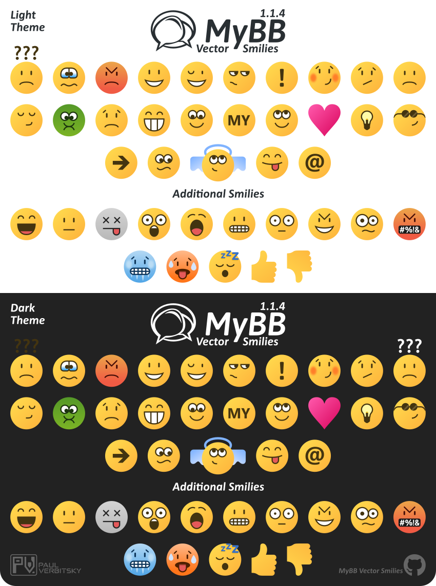

# MyBB Vector Smilies

  

## Project Overview

This repository contains a set of vector smilies designed specifically for use with the MyBB forum engine. They are based on the original raster smilie set of MyBB and aim to provide a high-quality, scalable set of standard smilies.

* **Date of Creation:** July 13, 2025
* **Version:** 1.0.0

### [Download latest version](https://github.com/Paul-Verbitsky/MyBB-Vector-Smilies/releases)

### Update Log

**[1.0.0] - 2025-07-13**
- Initial release of the MyBB Vector Smilies set.
- Includes the main set of 24 vectorized smilies from the standard MyBB 1.8.x smilie set.
- Features 1 additional 'huh' smiley specifically designed for dark themes.
- Contains 10 additional smilies, expanding the variety of expressions.
- All smilies are in SVG format, maintaining 21px original raster size.

## Contents of This Set

This vectorized smilie set includes:
* The **main set of 24 vectorized smilies** from the standard MyBB 1.8.x smilie set:
    * Angel
    * Angry
    * Arrow
    * At
    * Biggrin
    * Blush
    * Confused
    * Cool
    * Cry
    * Dodgy
    * Exclamation
    * Heart
    * Huh
    * Lightbulb
    * My
    * Rolleyes
    * Sad
    * Shy
    * Sick
    * Sleepy
    * Smile
    * Tongue
    * Undecided
    * Wink
* **1 additional 'huh' smilie** specifically designed for dark themes (featuring white question marks for better visibility on dark backgrounds):
    * Huh (Dark Theme)
* **10 additional smilies** (beyond the main set), expanding the variety of expressions:
    * Censored
    * Dead
    * Evil
    * Grimace
    * Lol
    * Neutral
    * Shocked
    * Surprise
    * Wtf
    * Yawn

All smilies are in **SVG format**, maintaining the original raster size of **21 pixels** for consistency.

## Usage & Integration (for MyBB Development Team)

This repository provides vectorized smilies for potential integration into the MyBB forum software, particularly for MyBB 1.9.

Upon integration into the official MyBB software package, these smilies will fall under the terms of the MyBB engine's general license (stated as **GNU Lesser General Public License, Version 3 - LGPLv3**).

Please ensure proper credit is given to the author, Paul Verbitsky, when using these smilies as part of the official MyBB software package/platform.

## License

This set of vector smilies is distributed under the terms of the **[GNU Lesser General Public License, Version 3 (LGPLv3)](https://www.gnu.org/licenses/lgpl-3.0.html)**.

## Author

**Paul Verbitsky (MyBB Forum Nick: [WikWik-12](https://community.mybb.com/user-157539.html))**
